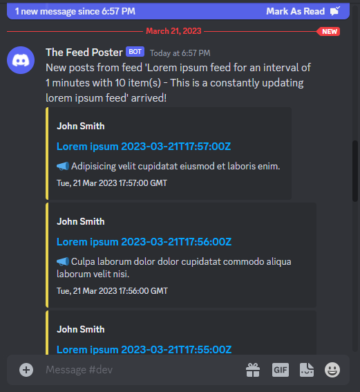

# discord-rss-webhook
This small .Net Core console app can be used to post RSS feed news to a Discord channel using a webhook.
It is customizable and able to filter certain feed categories.



## Prerequisites

You need a webhook URL to be able to post into a channel. Please have a look here how to get one: https://support.discord.com/hc/en-us/articles/228383668-Intro-to-Webhooks.  
Get the feed endpoint to be used e.g. https://lorem-rss.herokuapp.com/feed/

## Setting things up
Once you downloaded the zip file extract the two files to wherever you want. Might be e.g. `C:\Tools\discord-rss-webhook\`.
Now open the `discord-rss-webhook.dll.config` e.g. with Notepad/Editor and paste your webhook and feed URLs into the XML document:
```xml
<?xml version="1.0" encoding="utf-8" ?>
<configuration>
  <appSettings>
    <add key="Webhook" value="https://discord.com/api/webhooks/{webhook.id}/{webhook.token}"/>
    <add key="Feed" value="https://lorem-rss.herokuapp.com/feed/"/>
    <add key="UseExcerpt" value="true"/>
    <!-- Optional: Update interval in minutes, if empty or less than 1m or greater than 30d will default to 10m -->
    <add key="UpdateInterval" value=""/>
    <!-- Optional: Comma separated feed categories to be used as a filter, if empty all are used -->
    <add key="Categories" value=""/>
    <!-- Optional: A "bot" user name you like, if empty a default will be used -->
    <add key="UserName" value=""/>
    <!-- Optional: A "bot" avatar URL you like, if empty the feed icon will be used -->
    <add key="Avatar" value=""/>
    <!-- Optional: A custom content message showing up before the embeds, if empty a default will be used -->
    <add key="Content" value=""/>
  </appSettings>
</configuration>
```
You may change the optional settings like you want. Finally save the file.

## Run interactively
Open `cmd` or `terminal` at the location of the executable and run the application by typing either `discord-rss-webhook.exe` or `.\discord-rss-webhook.exe` and hit `enter`.

## Installation / Run as service

- On Windows
    - download the [NSSM](https://nssm.cc/download) and unzip
    - go to the x64 directory and open a `cmd`
    - type `nssm install discord-rss-webhook`
    - Set the path to where the `discord-rss-webhook.exe` is located
    - Start the service

This thing should also run on Linux, but I didn't test it so far.

### Limitations

Tested using a Wordpress feed and the [Lorem RSS feed](https://lorem-rss.herokuapp.com/) that are both of type **RSS 2.0**. So you might change the code itself currently if using something else.

### Why not a bot?
I started searching for already existing bots, started an own one but then came to the conclusion that using webhooks would be the easiest way to just get some feed news into a Discord channel.
Since there is no interaction needed or wanted with something that just delivers, why would one want to have another bot on the server hanging around in them member list doing nothing special? ;-)

### References
- https://github.com/arminreiter/FeedReader
- https://github.com/zzzprojects/html-agility-pack/
- https://github.com/mbdavid/LiteDB
- https://github.com/serilog/serilog
